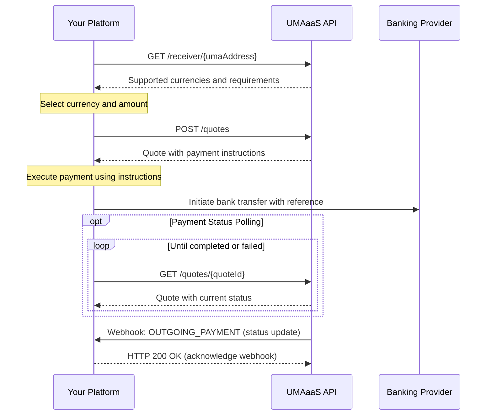
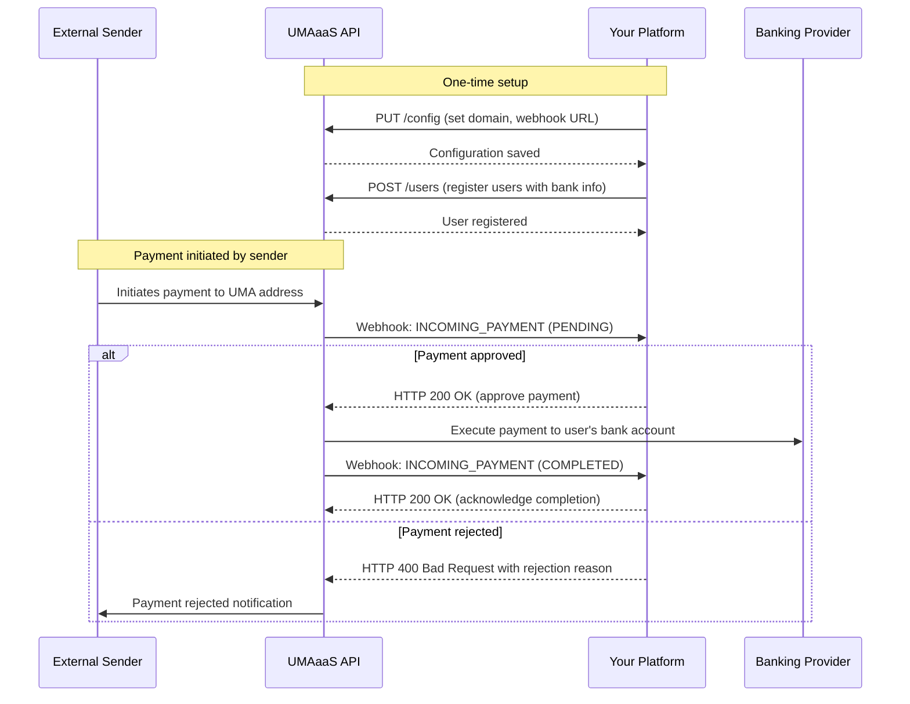

# UMA as a Service (UMAaas) API

UMA as a Service is an API that facilitates global payments to and from UMA addresses, which are human-readable addresses that can send to and from any currency.

## Overview

The UMAaas API provides endpoints for:

1. Platform Configuration - Managing platform-specific settings such as UMA domain and required counterparty fields
2. User Management - Adding and updating users with their UMA addresses and bank account information
3. Sending Payments - Creating and executing payments to UMA addresses
4. Receiving Payments - Receiving payments from UMA addresses and approving or rejecting them
5. Fetching Transactions - Fetching transactions by ID or by quote ID

## Authentication

All API requests must include HTTP Basic Authentication using the `Authorization` header. The credentials should be provided in the format `<api token id>:<api client secret>` and then Base64 encoded.

Example:

```http
Authorization: Basic <base64-encoded-credentials>
```

Where `<base64-encoded-credentials>` is the Base64 encoding of `<api token id>:<api client secret>`.

You can generate a new API token and client secret at any time in the UMAaas dashboard.

## API Documentation

The API is documented using the OpenAPI 3.1 specification. The full schema is available in the `openapi.yaml` file in this repository.

### Documentation Format

You can view the API documentation in several formats:

1. **Static HTML Documentation**: Use `npm run build:redoc` to generate HTML documentation, then open `generated/index.html`
2. **Markdown Documentation**: Use `npm run build:markdown` to generate markdown documentation in `generated/api-docs.md`
3. **Live Documentation Server**: Use `make serve-docs` to start a local documentation server for the Docusaurus docs. These docs are also available at [https://lightspark.github.io/umaaas-api/](https://lightspark.github.io/umaaas-api/)

## API Guides

We provide detailed guides for common workflows with the UMAaaS API:

- [Platform Configuration](./docusaurus-docs/docs/platform-configuration.md) - Guide to configuring your platform settings, UMA domain, and webhooks
- [Configuring Users](./docusaurus-docs/docs/configuring-users.md) - Comprehensive guide to user management, types, and bank account requirements
- [Sending Payments](./docusaurus-docs/docs/sending-payments.md) - Step-by-step guide to sending payments to UMA addresses
- [Receiving Payments](./docusaurus-docs/docs/receiving-payments.md) - How to receive payments from UMA addresses
- [Webhook Verification](./docusaurus-docs/docs/webhook-verification.md) - Security best practices for webhook verification

## Key Endpoints

- **User Management**
  - `POST /users` - Add a new user
  - `PATCH /users/{userId}` - Update a user by ID
  - `PATCH /users/by-platform-id/{platformUserId}` - Update a user by platform ID
  - `GET /users/{userId}` - Get a user by ID
  - `GET /users/by-platform-id/{platformUserId}` - Get a user by platform ID

- **Platform Configuration**
  - `GET /config` - Get platform configuration
  - `PUT /config` - Update platform configuration

- **Sending Payments**
  - `GET /receiver/{umaAddress}` - Get receiver information and supported currencies.
  - `POST /quotes` - Create a quote.
  - `GET /quotes/{quoteId}` - Get a quote by ID.
  - `GET /transactions/{transactionId}` - Get a transaction by ID.
  - `OUTGOING_PAYMENT` webhook - Notify when a payment is sent.

- **Receiving Payments**
  - `INCOMING_PAYMENT` webhook - Notified when a payment is pending and awaiting approval or when it is completed/failed.

- **Fetching Transactions**
  - `GET /transactions/{transactionId}` - Get a transaction by ID.
  - `GET /transactions/by-quote-id/{quoteId}` - Get a transaction by quote ID.
  - `GET /transactions` - Get a list of transactions with filtering and pagination options.

## Quick-Start Guides

### Sending Payments (Outgoing Flow)

This guide outlines the process for platforms to send payments to UMA addresses.

#### Process Overview

The following sequence diagram illustrates the interaction between your platform and the UMAaaS API when sending payments:



The process consists of five main steps:

1. **Look up the recipient's UMA address** to validate it and retrieve supported currencies
2. **Create a payment quote** to lock in exchange rates and get payment instructions
3. **Execute the payment** through your banking provider using the instructions
4. **Track the payment status** by polling or waiting for a webhook
5. **Receive completion notification** when the payment completes or fails

#### Step 1: Look up recipient UMA address

First, check if a UMA address is valid and retrieve supported currencies and exchange rates.

```http
GET /receiver/$recipient@example.com?platformUserId=9f84e0c2a72c4fa
```

Response:

```json
{
  "receivingUmaAddress": "$recipient@example.com",
  "supportedCurrencies": [
    {
      "currency": {
        "code": "USD",
        "name": "United States Dollar",
        "symbol": "$",
        "decimals": 2
      },
      "estimatedExchangeRate": 1.0,
      "min": 100,
      "max": 10000000
    },
    {
      "currency": {
        "code": "EUR",
        "name": "Euro",
        "symbol": "€",
        "decimals": 2
      },
      "estimatedExchangeRate": 0.92,
      "min": 100,
      "max": 9000000
    }
  ],
  "requiredPayerDataFields": [
    {
      "name": "FULL_NAME",
      "mandatory": true
    },
    {
      "name": "DATE_OF_BIRTH",
      "mandatory": true
    }
  ]
}
```

#### Step 2: Create a payment quote

Generate a quote for the payment with locked exchange rates and fees.

```http
POST /quotes
```

Request body:

```json
{
  "receiverUmaAddress": "$recipient@example.com",
  "platformUserId": "9f84e0c2a72c4fa",
  "sendingCurrencyCode": "USD",
  "receivingCurrencyCode": "EUR",
  "lockedCurrencySide": "SENDING",
  "lockedCurrencyAmount": 10000,
  "description": "Invoice #1234 payment"
}
```

Response:

```json
{
  "quoteId": "Quote:019542f5-b3e7-1d02-0000-000000000006",
  "sendingCurrency": {
    "code": "USD",
    "name": "United States Dollar",
    "symbol": "$",
    "decimals": 2
  },
  "receivingCurrency": {
    "code": "EUR",
    "name": "Euro",
    "symbol": "€",
    "decimals": 2
  },
  "totalSendingAmount": 10100,
  "totalReceivingAmount": 9200,
  "exchangeRate": 0.92,
  "expiresAt": "2023-09-01T14:30:00Z",
  "feesIncluded": 100,
  "counterpartyInformation": {
    "fullName": "Jane Doe",
    "dateOfBirth": "1992-03-25"
  },
  "paymentInstructions": {
    "reference": "UMA-Q12345-REF",
    "bankAccountInfo": {
      "accountType": "CLABE",
      "accountNumber": "987654321012345678",
      "bankName": "Banco de México"
    }
  }
}
```

#### Step 3: Execute the payment

Use the `paymentInstructions` from the quote to execute a payment through your banking provider. Be sure to include the provided reference code if applicable.

#### Step 4: Track payment status

You can track the status of your payment by polling the payment status endpoint or waiting for the webhook notification. To poll the payment status, use the following endpoint:

```http
GET /quotes/Quote:019542f5-b3e7-1d02-0000-000000000006
```

Response:

```json
{
  "quoteId": "Quote:019542f5-b3e7-1d02-0000-000000000006",
  "sendingCurrency": {
    "code": "USD",
    "name": "United States Dollar",
    "symbol": "$",
    "decimals": 2
  },
  "receivingCurrency": {
    "code": "EUR",
    "name": "Euro",
    "symbol": "€",
    "decimals": 2
  },
  "totalSendingAmount": 10100,
  "totalReceivingAmount": 9200,
  "exchangeRate": 0.92,
  "expiresAt": "2023-09-01T14:30:00Z",
  "feesIncluded": 100,
  "counterpartyInformation": {
    "fullName": "Jane Doe",
    "dateOfBirth": "1992-03-25"
  },
  "paymentInstructions": {
    "reference": "UMA-Q12345-REF",
    "bankAccountInfo": {
      "accountType": "CLABE",
      "accountNumber": "987654321012345678",
      "bankName": "Banco de México"
    }
  },
  "status": "COMPLETED",
  "transactionId": "Transaction:019542f5-b3e7-1d02-0000-000000000005"
}
```

#### Step 5: Receive webhook notification

When the payment status changes (to completed or failed), your platform will receive a webhook notification at your configured webhook endpoint:

```json
{
  "transaction": {
    "transactionId": "Transaction:019542f5-b3e7-1d02-0000-000000000005",
    "status": "COMPLETED",
    "type": "OUTGOING",
    "senderUmaAddress": "$sender@uma.domain",
    "receiverUmaAddress": "$recipient@external.domain",
    "sentAmount": {
      "amount": 10550,
      "currency": {
        "code": "USD",
        "name": "United States Dollar",
        "symbol": "$",
        "decimals": 2
      }
    },
    "receivedAmount": {
      "amount": 9706,
      "currency": {
        "code": "EUR",
        "name": "Euro",
        "symbol": "€",
        "decimals": 2
      }
    },
    "userId": "User:019542f5-b3e7-1d02-0000-000000000001",
    "platformUserId": "9f84e0c2a72c4fa",
    "settlementTime": "2023-08-15T14:30:00Z",
    "createdAt": "2023-08-15T14:25:18Z",
    "description": "Payment for invoice #1234",
    "exchangeRate": 0.92,
    "quoteId": "Quote:019542f5-b3e7-1d02-0000-000000000006"
  },
  "timestamp": "2023-08-15T14:32:00Z",
  "webhookId": "Webhook:019542f5-b3e7-1d02-0000-000000000007",
  "type": "OUTGOING_PAYMENT"
}
```

### Receiving Payments (Incoming Flow)

This guide outlines the process for platforms to receive payments from UMA addresses.

#### Process Overview

The following sequence diagram illustrates the interaction between your platform and the UMAaaS API when receiving payments:



The process consists of five main steps:

1. **Platform configuration** (one-time setup) to set your UMA domain and required counterparty fields
2. **Register users** with their bank account information so they can receive payments
3. **Set up webhook endpoints** to receive notifications about incoming payments
4. **Receive and approve/reject incoming payments** via webhooks
5. **Receive completion notification** when the payment completes

#### Step 1: Platform configuration (one-time setup)

Configure your platform settings (if you haven't already in the onboarding process), including the required counterparty information.

```http
PUT /config
```

Request body:

```json
{
  "umaDomain": "mycompany.com",
  "webhookEndpoint": "https://api.mycompany.com/webhooks/uma",
  "requiredCounterpartyFields": [
    {
      "name": "FULL_NAME",
      "mandatory": true
    },
    {
      "name": "DATE_OF_BIRTH",
      "mandatory": true
    }
  ]
}
```

#### Step 2: Register users with bank account information

First, register your users in the system so they can receive payments via UMA.

```http
POST /users
```

Request body:

```json
{
  "umaAddress": "$john.sender@uma.domain.com",
  "platformUserId": "9f84e0c2a72c4fa",
  "userType": "INDIVIDUAL",
  "fullName": "John Sender",
  "dateOfBirth": "1985-06-15",
  "address": {
    "line1": "123 Pine Street",
    "line2": "Unit 501",
    "city": "Mexico City",
    "state": "Mexico City",
    "postalCode": "01000",
    "country": "MX"
  },
  "bankAccountInfo": {
    "accountType": "CLABE",
    "accountNumber": "123456789012345678",
    "bankName": "Banco de México"
  }
}
```

#### Step 3: Webhook setup (one-time setup)

Configure your webhook endpoints to receive notifications about incoming payments. You'll need to implement the webhook endpoints on your server. Remember to validate webhook signatures to ensure they are authentic.

#### Step 4: Receive and approve incoming payments

When someone initiates a payment to one of your users' UMA addresses, you'll receive a webhook call with a pending transaction:

```json
{
  "transaction": {
    "transactionId": "Transaction:019542f5-b3e7-1d02-0000-000000000005",
    "status": "PENDING",
    "type": "INCOMING",
    "senderUmaAddress": "$sender@external.domain",
    "receiverUmaAddress": "$recipient@uma.domain",
    "receivedAmount": {
      "amount": 50000,
      "currency": {
        "code": "USD",
        "name": "United States Dollar",
        "symbol": "$",
        "decimals": 2
      }
    },
    "userId": "User:019542f5-b3e7-1d02-0000-000000000001",
    "platformUserId": "9f84e0c2a72c4fa",
    "counterpartyInformation": {
      "fullName": "John Sender",
      "dateOfBirth": "1985-06-15"
    }
  },
  "timestamp": "2023-08-15T14:32:00Z",
  "webhookId": "Webhook:019542f5-b3e7-1d02-0000-000000000007",
  "type": "INCOMING_PAYMENT"
}
```

To approve the payment, respond with a 200 OK status.

To reject the payment, respond with a 400 Bad Request status and a JSON body with the following fields:

```json
{
  "code": "payment_rejected",
  "message": "Payment rejected due to compliance policy",
  "details": {
    "reason": "failed_counterparty_check",
    "rejectionReason": "User is in a restricted jurisdiction"
  }
}
```

#### Step 5: Receive completion notification

When the payment completes, your webhook endpoint will receive another notification:

```json
{
  "transaction": {
    "transactionId": "Transaction:019542f5-b3e7-1d02-0000-000000000005",
    "status": "COMPLETED",
    "type": "INCOMING",
    "senderUmaAddress": "$sender@external.domain",
    "receiverUmaAddress": "$recipient@uma.domain",
    "receivedAmount": {
      "amount": 50000,
      "currency": {
        "code": "USD",
        "name": "United States Dollar",
        "symbol": "$",
        "decimals": 2
      }
    },
    "userId": "User:019542f5-b3e7-1d02-0000-000000000001",
    "platformUserId": "9f84e0c2a72c4fa",
    "settlementTime": "2023-08-15T14:30:00Z",
    "createdAt": "2023-08-15T14:25:18Z",
    "description": "Payment for services",
    "quoteId": "Quote:019542f5-b3e7-1d02-0000-000000000006"
  },
  "timestamp": "2023-08-15T14:32:00Z",
  "webhookId": "Webhook:019542f5-b3e7-1d02-0000-000000000007",
  "type": "INCOMING_PAYMENT"
}
```

## User Types

The API supports both individual and business users, with different required information for each:

### Individual Users

Required information:

- UMA address
- Platform user ID
- Full name
- Date of birth
- Physical address
- Bank account information

### Business Users

Required information:

- UMA address
- Platform user ID
- Business information (legal name required)
- Physical address
- Bank account information

Additional optional business information:

- Registration number
- Tax ID

When creating or updating users, the `userType` field must be specified as either `INDIVIDUAL` or `BUSINESS`, and the appropriate properties for that user type must be provided.

## Bank Account Information

The API supports various bank account formats based on country:

- Mexico: CLABE
- United States: Account and routing number
- Brazil: PIX address
- International: IBAN

## Webhook Verification

All webhooks sent by the UMAaaS API include a signature in the `X-UMAaaS-Signature` header, which allows you to verify the authenticity of the webhook. This is critical for security, as it ensures that only legitimate webhooks from UMAaaS are processed by your system.

### Signature Verification Process

1. **Obtain your webhook secret**
   - This is provided to you during the integration process
   - Keep this secret secure and never expose it publicly

2. **Verify incoming webhooks**
   - Extract the signature from the `X-UMAaaS-Signature` header
   - Create an HMAC-SHA256 hash of the entire request body using your webhook secret as the key
   - Encode the hash in hexadecimal format
   - Compare this calculated value with the signature from the header
   - Only process the webhook if the signatures match

### Verification Examples

#### Node.js Example

```javascript
const crypto = require('crypto');
const express = require('express');
const app = express();

// Your webhook secret provided during integration
const WEBHOOK_SECRET = 'your_webhook_secret';

app.use(express.json({
  verify: (req, res, buf) => {
    // Store the raw body for signature verification
    req.rawBody = buf;
  }
}));

app.post('/webhooks/uma', (req, res) => {
  const signature = req.header('X-UMAaaS-Signature');
  
  if (!signature) {
    return res.status(401).json({ error: 'Signature missing' });
  }
  
  // Calculate the expected signature
  const hmac = crypto.createHmac('sha256', WEBHOOK_SECRET);
  const calculatedSignature = hmac.update(req.rawBody).digest('hex');
  
  // Compare signatures using a timing-safe comparison to prevent timing attacks
  const isValid = crypto.timingSafeEqual(
    Buffer.from(calculatedSignature, 'hex'),
    Buffer.from(signature, 'hex')
  );
  
  if (!isValid) {
    return res.status(401).json({ error: 'Invalid signature' });
  }
  
  // Webhook is verified, process it based on type
  const webhookData = req.body;
  
  if (webhookData.type === 'INCOMING_PAYMENT') {
    // Process incoming payment webhook
    // ...
  } else if (webhookData.type === 'OUTGOING_PAYMENT') {
    // Process outgoing payment webhook
    // ...
  }
  
  // Acknowledge receipt of the webhook
  return res.status(200).json({ received: true });
});

app.listen(3000, () => {
  console.log('Webhook server listening on port 3000');
});
```

#### Python Example

```python
import hmac
import hashlib
from flask import Flask, request, jsonify

app = Flask(__name__)

# Your webhook secret provided during integration
WEBHOOK_SECRET = 'your_webhook_secret'

@app.route('/webhooks/uma', methods=['POST'])
def handle_webhook():
    # Get signature from header
    signature = request.headers.get('X-UMAaaS-Signature')
    if not signature:
        return jsonify({'error': 'Signature missing'}), 401
    
    # Calculate the expected signature
    request_body = request.get_data()
    calculated_signature = hmac.new(
        WEBHOOK_SECRET.encode('utf-8'),
        request_body,
        hashlib.sha256
    ).hexdigest()
    
    # Compare signatures
    if not hmac.compare_digest(calculated_signature, signature):
        return jsonify({'error': 'Invalid signature'}), 401
    
    # Webhook is verified, process it based on type
    webhook_data = request.json
    
    if webhook_data['type'] == 'INCOMING_PAYMENT':
        # Process incoming payment webhook
        # ...
        pass
    elif webhook_data['type'] == 'OUTGOING_PAYMENT':
        # Process outgoing payment webhook
        # ...
        pass
    
    # Acknowledge receipt of the webhook
    return jsonify({'received': True}), 200

if __name__ == '__main__':
    app.run(port=3000)
```

### Security Considerations

- **Always verify signatures**: Never process webhooks without verifying their signatures.
- **Use HTTPS**: Ensure your webhook endpoint uses HTTPS to prevent man-in-the-middle attacks.
- **Implement idempotency**: Use the `webhookId` field to prevent processing duplicate webhooks.
- **Timeout handling**: Implement proper timeout handling and respond to webhooks promptly.

## Development

### Requirements

- Node.js v16 or later
- npm v6 or later

### Setup

1. Clone this repository
2. Install dependencies: `npm install`
3. Build documentation: `npm run build`

### Building Documentation

To generate the documentation, you'll need Node.js (v16 or later) installed.

```bash
# Install dependencies
npm install

# Build docusaurus docs
cd docusaurus-docs && npm install
cd docusaurus-docs && npm run build

# Build only ReDoc HTML
npm run build:redoc

# Build only Markdown
npm run build:markdown

# Or use make and build all
make install
make build
```

This will generate documentation at:

- ReDoc: `generated/index.html`
- Markdown: `generated/api-docs.md`
- Docusaurus: `docusaurus-docs/build`

### Serving Documentation Locally

You can serve the documentation locally for development purposes:

```bash
# Serve ReDoc documentation
npm run serve:redoc

# Serve Docusaurus documentation
cd docusaurus-docs && npm run start

# Or use make
make serve-redoc
make serve-docs
```

### Linting the OpenAPI Schema

We use Redocly to lint the OpenAPI schema and markdown-lint to lint the markdown documentation:

```bash
npm run lint
# Or: make lint
```

## Support

For any questions or issues, please contact UMAaas support at <support@lightspark.com>.
