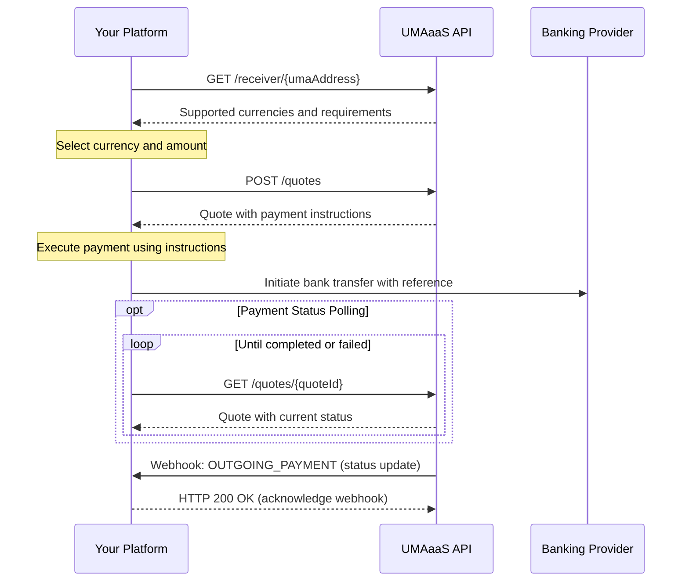

# UMA as a Service (UMAaas) API

UMA as a Service is an API that facilitates global payments to and from UMA addresses, which are human-readable addresses that can send to and from any currency.

## Overview

The UMAaas API provides endpoints for:

1. Platform Configuration - Managing platform-specific settings such as UMA domain and required counterparty fields
2. User Management - Adding and updating users with their UMA addresses and bank account information
3. Sending Payments - Creating and executing payments to UMA addresses
4. Receiving Payments - Receiving payments from UMA addresses and approving or rejecting them
5. Fetching Transactions - Fetching transactions by ID or by quote ID

## Authentication

All API requests must include HTTP Basic Authentication using the `Authorization` header. The credentials should be provided in the format `<api token id>:<api client secret>` and then Base64 encoded.

Example:

```http
Authorization: Basic <base64-encoded-credentials>
```

Where `<base64-encoded-credentials>` is the Base64 encoding of `<api token id>:<api client secret>`.

You can generate a new API token and client secret at any time in the UMAaas dashboard.

## API Documentation

The API is documented using the OpenAPI 3.1 specification. The full schema is available in the `openapi.yaml` file in this repository.

### Documentation Format

You can view the API documentation in two formats:

1. **Live Documentation Server**: Use `make serve-docs` to start a local documentation server for the Docusaurus docs. These docs are also available at [https://lightspark.github.io/umaaas-api/](https://lightsparkdev.github.io/umaaas-api/)
2. **Markdown Documentation**: Use `npm run build:markdown` to generate markdown documentation in `generated/api-docs.md`

## API Guides

We provide detailed guides for common workflows with the UMAaaS API:

- [Platform Configuration](./docusaurus-docs/docs/platform-configuration.md) - Guide to configuring your platform settings, UMA domain, and webhooks
- [Configuring Users](./docusaurus-docs/docs/configuring-users.md) - Comprehensive guide to user management, types, and bank account requirements
- [Sending Payments](./docusaurus-docs/docs/sending-payments.md) - Step-by-step guide to sending payments to UMA addresses
- [Receiving Payments](./docusaurus-docs/docs/receiving-payments.md) - How to receive payments from UMA addresses
- [Webhooks](./docusaurus-docs/docs/webhooks.md) - Security best practices for webhook verification
- [Sandbox Environment](./docusaurus-docs/docs/sandbox.md) - How to use the sandbox environment for testing
- [Invitations](./docusaurus-docs/docs/invitations.md) - How to create and manage UMA invitations

## Key Endpoints

- **User Management**
  - `POST /users` - Add a new user
  - `PATCH /users/{userId}` - Update a user by ID
  - `GET /users/{userId}` - Get a user by ID
- **Platform Configuration**
  - `GET /config` - Get platform configuration
  - `PATCH /config` - Update platform configuration
- **Sending Payments**
  - `GET /receiver/{receiverUmaAddress}` - Get receiver information and supported currencies.
  - `POST /quotes` - Create a quote.
  - `GET /quotes/{quoteId}` - Get a quote by ID.
  - `GET /transactions/{transactionId}` - Get a transaction by ID.
  - `OUTGOING_PAYMENT` webhook - Notify when a payment is sent.
- **Receiving Payments**
  - `INCOMING_PAYMENT` webhook - Notified when a payment is pending and awaiting approval or when it is completed/failed.
- **Fetching Transactions**
  - `GET /transactions/{transactionId}` - Get a transaction by ID.
  - `GET /transactions` - Get a list of transactions with filtering and pagination options.

## Quick-Start Guides

### Sending Payments (Outgoing Flow)

This guide outlines the process for platforms to send payments to UMA addresses.

#### Process Overview

The following sequence diagram illustrates the interaction between your platform and the UMAaaS API when sending payments:



The process consists of five main steps:

1. **Look up the recipient's UMA address** to validate it and retrieve supported currencies
2. **Create a payment quote** to lock in exchange rates and get payment instructions
3. **Execute the payment** through your banking provider using the instructions
4. **Track the payment status** by polling or waiting for a webhook
5. **Receive completion notification** when the payment completes or fails

#### Step 1: Look up recipient UMA address

First, check if a UMA address is valid and retrieve supported currencies and exchange rates.

```http
GET /receiver/$recipient@example.com?userId=9f84e0c2a72c4fa
```

Response:

```json
{
  "receivingUmaAddress": "$recipient@example.com",
  "supportedCurrencies": [
    {
      "currency": {
        "code": "USD",
        "name": "United States Dollar",
        "symbol": "$",
        "decimals": 2
      },
      "estimatedExchangeRate": 1.0,
      "min": 100,
      "max": 10000000
    },
    {
      "currency": {
        "code": "EUR",
        "name": "Euro",
        "symbol": "€",
        "decimals": 2
      },
      "estimatedExchangeRate": 0.92,
      "min": 100,
      "max": 9000000
    }
  ],
  "requiredPayerDataFields": [
    {
      "name": "FULL_NAME",
      "mandatory": true
    },
    {
      "name": "BIRTH_DATE",
      "mandatory": true
    }
  ],
  "lookupId": "Lookup:019542f5-b3e7-1d02-0000-000000000009"
}
```

#### Step 2: Create a payment quote

Generate a quote for the payment with locked exchange rates and fees.

```http
POST /quotes
```

Request body:

```json
{
  "lookupId": "Lookup:019542f5-b3e7-1d02-0000-000000000009",
  "sendingCurrencyCode": "USD",
  "receivingCurrencyCode": "EUR",
  "lockedCurrencySide": "SENDING",
  "lockedCurrencyAmount": 10000,
  "description": "Invoice #1234 payment"
}
```

Response:

```json
{
  "quoteId": "Quote:019542f5-b3e7-1d02-0000-000000000006",
  "sendingCurrency": {
    "code": "USD",
    "name": "United States Dollar",
    "symbol": "$",
    "decimals": 2
  },
  "receivingCurrency": {
    "code": "EUR",
    "name": "Euro",
    "symbol": "€",
    "decimals": 2
  },
  "totalSendingAmount": 10100,
  "totalReceivingAmount": 9200,
  "exchangeRate": 0.92,
  "expiresAt": "2023-09-01T14:30:00Z",
  "feesIncluded": 100,
  "counterpartyInformation": {
    "FULL_NAME": "Jane Receiver",
    "BIRTH_DATE": "1990-01-01"
  },
  "paymentInstructions": {
    "reference": "UMA-Q12345-REF",
    "bankAccountInfo": {
      "accountType": "CLABE",
      "clabeNumber": "123456789012345678",
      "bankName": "BBVA Mexico"
    }
  }
}
```

#### Step 3: Execute the payment

Use the `paymentInstructions` from the quote to execute a payment through your banking provider. Be sure to include the provided reference code if applicable.

#### Step 4: Track payment status

You can track the status of your payment by polling the payment status endpoint or waiting for the webhook notification. To poll the payment status, use the following endpoint:

```http
GET /quotes/Quote:019542f5-b3e7-1d02-0000-000000000006
```

Response:

```json
{
  "quoteId": "Quote:019542f5-b3e7-1d02-0000-000000000006",
  "sendingCurrency": {
    "code": "USD",
    "name": "United States Dollar",
    "symbol": "$",
    "decimals": 2
  },
  "receivingCurrency": {
    "code": "EUR",
    "name": "Euro",
    "symbol": "€",
    "decimals": 2
  },
  "totalSendingAmount": 10100,
  "totalReceivingAmount": 9200,
  "exchangeRate": 0.92,
  "expiresAt": "2023-09-01T14:30:00Z",
  "feesIncluded": 100,
  "counterpartyInformation": {
    "FULL_NAME": "Jane Receiver",
    "BIRTH_DATE": "1990-01-01"
  },
  "paymentInstructions": {
    "reference": "UMA-Q12345-REF",
    "bankAccountInfo": {
      "accountType": "CLABE",
      "clabeNumber": "123456789012345678",
      "bankName": "BBVA Mexico"
    }
  },
  "status": "COMPLETED",
  "transactionId": "Transaction:019542f5-b3e7-1d02-0000-000000000005"
}
```

#### Step 5: Receive webhook notification

When the payment status changes (to completed or failed), your platform will receive a webhook notification at your configured webhook endpoint:

```json
{
  "transaction": {
    "transactionId": "Transaction:019542f5-b3e7-1d02-0000-000000000005",
    "status": "COMPLETED",
    "type": "OUTGOING",
    "senderUmaAddress": "$sender@uma.domain",
    "receiverUmaAddress": "$recipient@external.domain",
    "sentAmount": {
      "amount": 10550,
      "currency": {
        "code": "USD",
        "name": "United States Dollar",
        "symbol": "$",
        "decimals": 2
      }
    },
    "receivedAmount": {
      "amount": 9706,
      "currency": {
        "code": "EUR",
        "name": "Euro",
        "symbol": "€",
        "decimals": 2
      }
    },
    "userId": "User:019542f5-b3e7-1d02-0000-000000000001",
    "platformUserId": "9f84e0c2a72c4fa",
    "settledAt": "2023-08-15T14:30:00Z",
    "createdAt": "2023-08-15T14:25:18Z",
    "description": "Payment for invoice #1234",
    "exchangeRate": 0.92,
    "quoteId": "Quote:019542f5-b3e7-1d02-0000-000000000006",
  },
  "timestamp": "2023-08-15T14:32:00Z",
  "webhookId": "Webhook:019542f5-b3e7-1d02-0000-000000000007",
  "type": "OUTGOING_PAYMENT"
}
```

### Receiving Payments (Incoming Flow)

This guide outlines the process for platforms to receive payments from UMA addresses.

#### Process Overview

The following sequence diagram illustrates the interaction between your platform and the UMAaaS API when receiving payments:

```mermaid
sequenceDiagram
    participant Sender as External Sender
    participant UMAaaS as UMAaaS API
    participant Client as Your Platform
    participant Bank as Banking Provider
    
    Note over Client, UMAaaS: One-time setup
    Client->>UMAaaS: PATCH /config (set domain, webhook URL)
    UMAaaS-->>Client: Configuration saved
    Client->>UMAaaS: POST /users (register users with bank info)
    UMAaaS-->>Client: User registered
    
    Note over Sender, UMAaaS: Payment initiated by sender
    Sender->>UMAaaS: Initiates payment to UMA address
    UMAaaS->>Client: Webhook: INCOMING_PAYMENT (PENDING)
    
    alt Synchronous Approval/Rejection
        alt Payment approved
            Client-->>UMAaaS: HTTP 200 OK (approve payment)
            UMAaaS->>Bank: Execute payment to user's bank account
            UMAaaS->>Client: Webhook: INCOMING_PAYMENT (COMPLETED)
            Client-->>UMAaaS: HTTP 200 OK (acknowledge completion)
        else Payment rejected
            Client-->>UMAaaS: HTTP 403 Forbidden with rejection reason
            UMAaaS->>Sender: Payment rejected notification
        end
    else Asynchronous Processing (within 5 seconds)
        Client-->>UMAaaS: HTTP 202 Accepted
        Client->>UMAaaS: /transactions/{transactionId}/approve or /reject
        opt Approved
          UMAaaS->>Bank: Execute payment to user's bank account
          UMAaaS->>Client: Webhook: INCOMING_PAYMENT (COMPLETED)
          Client-->>UMAaaS: HTTP 200 OK (acknowledge completion)
        else Rejected
          UMAaaS->>Sender: Payment rejected notification
        end
    end
```

The process consists of five main steps:

1. **Platform configuration** (one-time setup) to set your UMA domain and required counterparty fields
2. **Register users** with their bank account information so they can receive payments
3. **Set up webhook endpoints** to receive notifications about incoming payments
4. **Receive and approve/reject incoming payments** via webhooks
5. **Receive completion notification** when the payment completes

#### Step 1: Platform configuration (one-time setup)

Configure your platform settings (if you haven't already in the onboarding process), including the required counterparty information.

```http
PATCH /config
```

Request body:

```json
{
  "umaDomain": "mycompany.com",
  "webhookEndpoint": "https://api.mycompany.com/webhooks/uma",
  "supportedCurrencies": [
    {
      "currencyCode": "USD",
      "minAmount": 100,
      "maxAmount": 1000000,
      "requiredCounterpartyFields": [
        {
          "name": "FULL_NAME",
          "mandatory": true
        },
        {
          "name": "BIRTH_DATE",
          "mandatory": true
        }
      ]
    }
  ]
}
```

#### Step 2: Register users with bank account information

First, register your users in the system so they can receive payments via UMA.

```http
POST /users
```

Request body:

```json
{
  "umaAddress": "$john.sender@uma.domain.com",
  "platformUserId": "9f84e0c2a72c4fa",
  "userType": "INDIVIDUAL",
  "fullName": "John Sender",
  "birthDate": "1985-06-15",
  "address": {
    "line1": "123 Pine Street",
    "line2": "Unit 501",
    "city": "Mexico City",
    "state": "Mexico City",
    "postalCode": "01000",
    "country": "MX"
  },
  "bankAccountInfo": {
    "accountType": "CLABE",
    "accountNumber": "123456789012345678",
    "bankName": "Banco de México"
  }
}
```

#### Step 3: Webhook setup (one-time setup)

Configure your webhook endpoints to receive notifications about incoming payments. You'll need to implement the webhook endpoints on your server. Remember to validate webhook signatures to ensure they are authentic.

#### Step 4: Receive and approve incoming payments

When someone initiates a payment to one of your users' UMA addresses, you'll receive a webhook call with a pending transaction:

```json
{
  "transaction": {
    "transactionId": "Transaction:019542f5-b3e7-1d02-0000-000000000005",
    "status": "PENDING",
    "type": "INCOMING",
    "senderUmaAddress": "$sender@external.domain",
    "receiverUmaAddress": "$recipient@uma.domain",
    "receivedAmount": {
      "amount": 50000,
      "currency": {
        "code": "USD",
        "name": "United States Dollar",
        "symbol": "$",
        "decimals": 2
      }
    },
    "userId": "User:019542f5-b3e7-1d02-0000-000000000001",
    "platformUserId": "9f84e0c2a72c4fa",
    "counterpartyInformation": {
      "FULL_NAME": "John Sender",
      "BIRTH_DATE": "1985-06-15"
    },
    "reconciliationInstructions": {
      "reference": "REF-123456789"
    }
  },
  "timestamp": "2023-08-15T14:32:00Z",
  "webhookId": "Webhook:019542f5-b3e7-1d02-0000-000000000007",
  "type": "INCOMING_PAYMENT"
}
```

To approve the payment synchronously, respond with a 200 OK status.

To reject the payment synchronously, respond with a 403 Forbidden status and a JSON body with the following fields (see API spec for error codes):

```json
{
  "code": "REJECTED_BY_PLATFORM",
  "message": "Payment rejected due to compliance policy.",
  "reason": "FAILED_COUNTERPARTY_CHECK"
}
```

Alternatively, to process the payment asynchronously, return a 202 Accepted response. Then, you must call the `/transactions/{transactionId}/approve` or `/transactions/{transactionId}/reject` endpoint within 5 seconds. Synchronous approval/rejection is preferred where possible.

#### Step 5: Receive completion notification

When the payment completes, your webhook endpoint will receive another notification:

```json
{
  "transaction": {
    "transactionId": "Transaction:019542f5-b3e7-1d02-0000-000000000005",
    "status": "COMPLETED",
    "type": "INCOMING",
    "senderUmaAddress": "$sender@external.domain",
    "receiverUmaAddress": "$recipient@uma.domain",
    "receivedAmount": {
      "amount": 50000,
      "currency": {
        "code": "USD",
        "name": "United States Dollar",
        "symbol": "$",
        "decimals": 2
      }
    },
    "userId": "User:019542f5-b3e7-1d02-0000-000000000001",
    "platformUserId": "9f84e0c2a72c4fa",
    "settledAt": "2023-08-15T14:30:00Z",
    "createdAt": "2023-08-15T14:25:18Z",
    "description": "Payment for services",
    "reconciliationInstructions": {
      "reference": "REF-123456789"
    },
  },
  "timestamp": "2023-08-15T14:32:00Z",
  "webhookId": "Webhook:019542f5-b3e7-1d02-0000-000000000007",
  "type": "INCOMING_PAYMENT"
}
```

## User Types

The API supports both individual and business users, with different required information for each:

### Individual Users

Required information:

- UMA address
- Platform user ID
- Full name
- Date of birth
- Physical address
- Bank account information

### Business Users

Required information:

- UMA address
- Platform user ID
- Business information (legal name required)
- Physical address
- Bank account information

Additional optional business information:

- Registration number
- Tax ID

When creating or updating users, the `userType` field must be specified as either `INDIVIDUAL` or `BUSINESS`, and the appropriate properties for that user type must be provided.

## Bank Account Information

The API supports various bank account formats based on country:

- Mexico: CLABE
- United States: Account and routing number
- Brazil: PIX address
- International: IBAN

## Webhook Verification

All webhooks sent by the UMAaaS API include a signature in the `X-UMAaaS-Signature` header, which allows you to verify the authenticity of the webhook. This is critical for security, as it ensures that only legitimate webhooks from UMAaaS are processed by your system.

### Signature Verification Process

To verify the signature:

1. **Obtain the UMAaaS Public Key**: You should receive your P-256 (secp256r1) public key in PEM format from UMAaaS during your integration. Store it securely (e.g., as an environment variable).
2. **Get the Raw Request Body**: It is crucial to use the exact raw byte string of the incoming request body. Do not parse or modify it before hashing.
3. **Create a SHA-256 Hash of the Request Body**: Compute the SHA-256 hash of the raw request body.
4. **Extract the Signature**: The `X-UMAaaS-Signature` header contains a JSON string, for example: `{"v": "1", "s": "BASE64_ENCODED_SIGNATURE"}`. Parse this JSON and extract the Base64-encoded signature string from the `s` field.
5. **Decode the Signature**: Base64 decode the extracted signature string to get the raw signature bytes.
6. **Verify the Signature**: Use a standard cryptographic library that supports ECDSA with the P-256 curve and SHA-256. Verify the SHA-256 hash of the request body (from step 3) against the decoded signature bytes (from step 5) using your UMAaaS P-256 public key.

If the signature verification succeeds, the webhook is authentic. If not, it should be rejected (e.g., with an HTTP 401 Unauthorized response).

### Verification Examples

Note: The following examples assume you have the UMAaaS P-256 public key (PEM encoded) stored in an environment variable `UMAAS_PUBLIC_KEY_PEM`.

#### Node.js Example

This example uses the built-in `crypto` module available in Node.js.

```javascript
const crypto = require('crypto');
const express = require('express');
const app = express();

// The UMAaaS P-256 public key (PEM encoded), provided during integration
const umaasPublicKeyPem = process.env.UMAAS_PUBLIC_KEY_PEM;

if (!umaasPublicKeyPem) {
  console.error('UMAaaS public key (PEM) is not configured. Please set UMAAS_PUBLIC_KEY_PEM environment variable.');
  process.exit(1);
}

// Middleware to get the raw body
app.use(express.json({
  verify: (req, res, buf, encoding) => {
    if (buf && buf.length) {
      // Store the raw buffer for hashing, and string for potential logging (careful with PII)
      req.rawBodyBuffer = buf;
      req.rawBodyString = buf.toString(encoding || 'utf-8');
    } else {
      req.rawBodyBuffer = Buffer.alloc(0);
      req.rawBodyString = '';
    }
  }
}));

app.post('/webhooks/uma', (req, res) => {
  const signatureHeader = req.header('X-UMAaaS-Signature');

  if (!signatureHeader) {
    console.warn('Signature missing from X-UMAaaS-Signature header');
    return res.status(401).json({ error: 'Signature missing' });
  }

  try {
    let signatureBase64;
    try {
      const signatureObject = JSON.parse(signatureHeader);
      if (typeof signatureObject.s !== 'string') {
        throw new Error('Signature string (s) not found in JSON header');
      }
      signatureBase64 = signatureObject.s;
    } catch (jsonError) {
      // Fallback for plain base64 signature if JSON parsing fails or if it's not an object with 's'
      // This fallback might be removed if the JSON structure is strictly enforced.
      console.warn('Failed to parse signature header as JSON, trying as plain base64: ', jsonError.message);
      if (typeof signatureHeader === 'string' && signatureHeader.length > 0) {
        signatureBase64 = signatureHeader;
      } else {
        return res.status(400).json({ error: 'Invalid signature header format' });
      }
    }

    const publicKey = crypto.createPublicKey({
      key: umaasPublicKeyPem,
      format: 'pem'
    });

    const signatureBytes = Buffer.from(signatureBase64, 'base64');
    
    // Create a SHA-256 hash of the raw request body
    const requestBodyHash = crypto.createHash('sha256').update(req.rawBodyBuffer).digest();

    const verify = crypto.createVerify('SHA256');
    verify.update(requestBodyHash); // Verify against the hash of the body
    // OR, some libraries might expect the original data for certain verify setups:
    // verify.update(req.rawBodyBuffer); // If the public key type implies the hashing algorithm.
                                       // For clarity and safety, verifying against the explicit hash is better.

    const isValid = verify.verify(publicKey, signatureBytes);

    if (!isValid) {
      console.warn('Invalid signature');
      return res.status(401).json({ error: 'Invalid signature' });
    }

    // Webhook is verified, process it based on type
    const webhookData = req.body; // req.body is the parsed JSON from express.json()
    console.log(`Webhook verified and processing type: ${webhookData.type}`);

    // Process webhookData.type...
    // Example: if (webhookData.type === 'INCOMING_PAYMENT') { /* ... */ }

    return res.status(200).json({ received: true });

  } catch (error) {
    console.error('Error during signature verification:', error.message, error.stack);
    return res.status(500).json({ error: 'Signature verification process error' });
  }
});

const port = process.env.PORT || 3000;
app.listen(port, () => {
  console.log(`Webhook server listening on port ${port}`);
});
```

#### Python Example

This example uses the `ecdsa` library for P-256 signature verification and `hashlib` for SHA256 hashing. You may need to install it: `pip install ecdsa hashlib`.

```python
import os
import base64
import json
import hashlib
from ecdsa import VerifyingKey, NIST256p, BadSignatureError
from flask import Flask, request, jsonify

app = Flask(__name__)

# The UMAaaS P-256 public key (PEM encoded), provided during integration
UMAAS_PUBLIC_KEY_PEM = os.environ.get('UMAAS_PUBLIC_KEY_PEM')

if not UMAAS_PUBLIC_KEY_PEM:
    raise ValueError("UMAaaS public key (PEM) is not configured. Please set UMAAS_PUBLIC_KEY_PEM environment variable.")

try:
    # The hashfunc=hashlib.sha256 here is for the key itself if needed, not for the data hash verification method directly.
    # The verify method will take the data hash.
    UMAAS_VERIFY_KEY = VerifyingKey.from_pem(UMAAS_PUBLIC_KEY_PEM, hashfunc=hashlib.sha256)
except Exception as e:
    raise ValueError(f"Failed to load UMAaaS public key from PEM: {e}")

@app.route('/webhooks/uma', methods=['POST'])
def handle_webhook():
    signature_header = request.headers.get('X-UMAaaS-Signature')
    if not signature_header:
        print("Signature missing from X-UMAaaS-Signature header")
        return jsonify({'error': 'Signature missing'}), 401

    try:
        signature_base64 = json.loads(signature_header).get('s')
        if not isinstance(signature_base64, str):
            raise ValueError("Signature string (s) not found or not a string in JSON header")
    except (json.JSONDecodeError, ValueError) as e:
        # Fallback for plain base64 signature for robustness, though spec implies JSON.
        print(f"Could not parse signature header as JSON or 's' field missing/invalid: {e}. Trying as plain base64.")
        if isinstance(signature_header, str) and len(signature_header) > 0:
            signature_base64 = signature_header
        else:
             return jsonify({'error': 'Invalid signature header format'}), 400

    try:
        signature_bytes = base64.b64decode(signature_base64)
    except Exception as e:
        print(f"Invalid base64 encoding for signature: {e}")
        return jsonify({'error': 'Invalid signature encoding'}), 401

    # Get raw request body and hash it with SHA-256
    request_body_bytes = request.get_data()
    request_body_hash_bytes = hashlib.sha256(request_body_bytes).digest()

    try:
        # The verify method takes the signature and the hash of the data.
        # The curve (NIST256p) is inherent in the VerifyingKey object.
        # The hashfunc parameter in verify is for the digest algorithm if the key can be used with multiple, 
        # but for ECDSA it's usually tied to the key or specified at key loading.
        # Here, we pass the raw hash.
        is_valid = UMAAS_VERIFY_KEY.verify(signature_bytes, request_body_hash_bytes, hashfunc=hashlib.sha256, sigdecode=ecdsa.util.sigdecode_der)
        # Note: sigdecode=ecdsa.util.sigdecode_der might be needed if the signature is in DER format.
        # If the signature is just raw r and s values concatenated, sigdecode might not be needed or a different one used.
        # Assuming DER which is common for ECDSA signatures.
    except BadSignatureError:
        print("Invalid signature")
        return jsonify({'error': 'Invalid signature'}), 401
    except Exception as e:
        print(f"Error during signature verification: {e}")
        return jsonify({'error': 'Signature verification process error'}), 500

    # Webhook is verified, process it based on type
    webhook_data = request.json # This is the parsed JSON from Flask
    print(f"Webhook verified and processing type: {webhook_data.get('type')}")
    
    # Process webhook_data.get('type')
    # Example: if webhook_data.get('type') == 'INCOMING_PAYMENT':
    #     print("Processing INCOMING_PAYMENT webhook...")

    return jsonify({'received': True}), 200

if __name__ == '__main__':
    port = int(os.environ.get("PORT", 3000))
    app.run(host='0.0.0.0', port=port)
```

### Security Considerations

- **Always verify signatures**: Never process webhooks without verifying their signatures.
- **Use HTTPS**: Ensure your webhook endpoint uses HTTPS to prevent man-in-the-middle attacks.
- **Implement idempotency**: Use the `webhookId` field to prevent processing duplicate webhooks.
- **Timeout handling**: Implement proper timeout handling and respond to webhooks promptly.

## Development

### Requirements

- Node.js v16 or later
- npm v6 or later

### Setup

1. Clone this repository
2. Install dependencies: `npm install`
3. Build documentation: `npm run build`

### Building Documentation

To generate the documentation, you'll need Node.js (v16 or later) installed.

```bash
# Install dependencies
npm install

# Build docusaurus docs
cd docusaurus-docs && npm install
cd docusaurus-docs && npm run build

# Or use make and build all
make install
make build
```

This will generate documentation at:

- Markdown: `generated/api-docs.md`
- Docusaurus: `docusaurus-docs/build`

### Serving Documentation Locally

You can serve the documentation locally for development purposes:

```bash
# Serve Docusaurus documentation
cd docusaurus-docs && npm run start

# Or use make
make serve-docs

# Serve Mintlify documentation:

# First install mint if you haven't already
npm i -g mint

mint dev # or make mint
```

## OpenAPI
We use Redocly to split and merge OpenAPI schema you can install it with:

`npm i -g @redocly/cli@latest`

### Merging openapi schema 
You can merge openapi schema with 
`redocly bundle openapi/openapi.yaml -o openapi.yaml`

### Linting the OpenAPI Schema

We use Redocly to lint the OpenAPI schema and markdown-lint to lint the markdown documentation:

```bash
npm run lint
# Or: make lint
```

## Support

For any questions or issues, please contact UMAaas support at <support@lightspark.com>.
