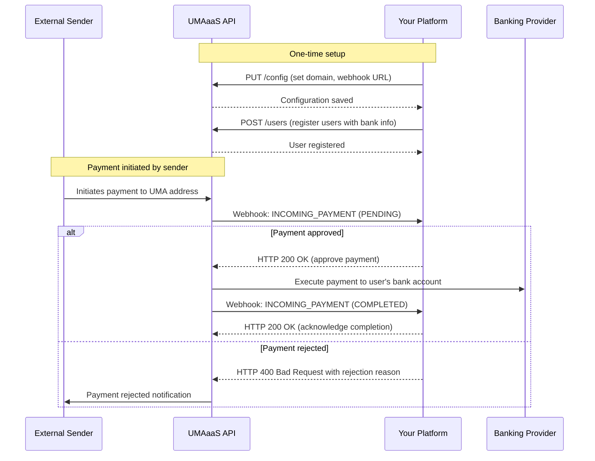
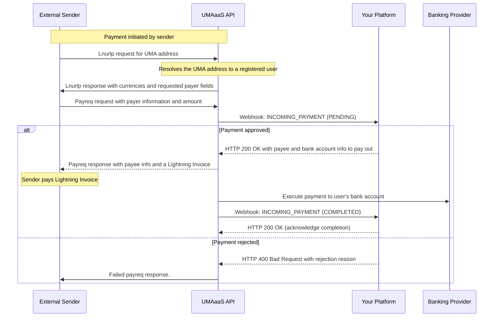

# Receiving Payments

This guide outlines the process for platforms to receive payments from UMA addresses.

## Process Overview

The following sequence diagram illustrates the interaction between your platform and the UMAaaS API when receiving payments:



The process consists of five main steps:

1. **Platform configuration** (one-time setup) to set your UMA domain and required counterparty fields
2. **Register users** with their bank account information so they can receive payments
3. **Set up webhook endpoints** to receive notifications about incoming payments
4. **Receive and approve/reject incoming payments** via webhooks
5. **Receive completion notification** when the payment completes

## Step 1: Platform configuration (one-time setup)

Configure your platform settings (if you haven't already in the onboarding process). See the [Platform Configuration](/docs/platform-configuration) guide for more details.

## Step 2: Register users with bank account information

First, register your users in the system so they can receive payments via UMA. You can optionally include a `platformAccountId` in the bank account information to link accounts with your internal systems.

```http
POST /users
```

Request body:

```json
{
  "umaAddress": "$john.receiver@thegoodbank.com",
  "platformUserId": "9f84e0c2a72c4fa",
  "userType": "INDIVIDUAL",
  "fullName": "John Receiver",
  "dateOfBirth": "1985-06-15",
  "address": {
    "line1": "123 Pine Street",
    "line2": "Unit 501",
    "city": "Seattle",
    "state": "WA",
    "postalCode": "98101",
    "country": "US"
  },
  "bankAccountInfo": {
    "accountType": "US_ACCOUNT",
    "accountNumber": "123456789",
    "routingNumber": "987654321",
    "accountCategory": "CHECKING",
    "bankName": "Chase Bank",
    "platformAccountId": "chase_primary_1234"
  }
}
```

See the [Configuring Users](/docs/configuring-users) guide for more details.

## Step 3: Webhook setup (one-time setup)

Configure your webhook endpoints to receive notifications about incoming payments. You'll need to implement the webhook endpoints on your server. Remember to validate webhook signatures to ensure they are authentic. See the [Webhook Verification](/docs/webhook-verification) guide for more details.

## Step 4: Receive and approve incoming payments

When someone initiates a payment to one of your users' UMA addresses, you'll receive a webhook call with a pending transaction:

```json
{
  "transaction": {
    "transactionId": "Transaction:019542f5-b3e7-1d02-0000-000000000005",
    "status": "PENDING",
    "type": "INCOMING",
    "senderUmaAddress": "$mary.sender@thelessgoodbank.com",
    "receiverUmaAddress": "$john.receiver@thegoodbank.com",
    "receivedAmount": {
      "amount": 50000,
      "currency": {
        "code": "USD",
        "name": "United States Dollar",
        "symbol": "$",
        "decimals": 2
      }
    },
    "userId": "User:019542f5-b3e7-1d02-0000-000000000001",
    "platformUserId": "9f84e0c2a72c4fa",
    "counterpartyInformation": {
      "fullName": "Mary Sender",
      "dateOfBirth": "1985-06-15"
    }
  },
  "timestamp": "2023-08-15T14:32:00Z",
  "webhookId": "Webhook:019542f5-b3e7-1d02-0000-000000000007",
  "type": "INCOMING_PAYMENT"
}
```

To approve the payment, respond with a 200 OK status.

To reject the payment, respond with a 400 Bad Request status and a JSON body with the following fields:

```json
{
  "code": "payment_rejected",
  "message": "Payment rejected due to compliance policy",
  "details": {
    "reason": "failed_counterparty_check",
    "rejectionReason": "User is in a restricted jurisdiction"
  }
}
```

## Step 5: Receive completion notification

When the payment completes, your webhook endpoint will receive another notification:

```json
{
  "transaction": {
    "transactionId": "Transaction:019542f5-b3e7-1d02-0000-000000000005",
    "status": "COMPLETED",
    "type": "INCOMING",
    "senderUmaAddress": "$mary.sender@thelessgoodbank.com",
    "receiverUmaAddress": "$john.receiver@thegoodbank.com",
    "receivedAmount": {
      "amount": 50000,
      "currency": {
        "code": "USD",
        "name": "United States Dollar",
        "symbol": "$",
        "decimals": 2
      }
    },
    "userId": "User:019542f5-b3e7-1d02-0000-000000000001",
    "platformUserId": "9f84e0c2a72c4fa",
    "settlementTime": "2023-08-15T14:30:00Z",
    "createdAt": "2023-08-15T14:25:18Z",
    "description": "Payment for services",
    "quoteId": "Quote:019542f5-b3e7-1d02-0000-000000000006"
  },
  "timestamp": "2023-08-15T14:32:00Z",
  "webhookId": "Webhook:019542f5-b3e7-1d02-0000-000000000007",
  "type": "INCOMING_PAYMENT"
}
```

## Detailed UMA flow

This section is not necessary knowledge for platforms, but it describes the flow at a more detailed level including UMA protocol messages for those who are curious.


