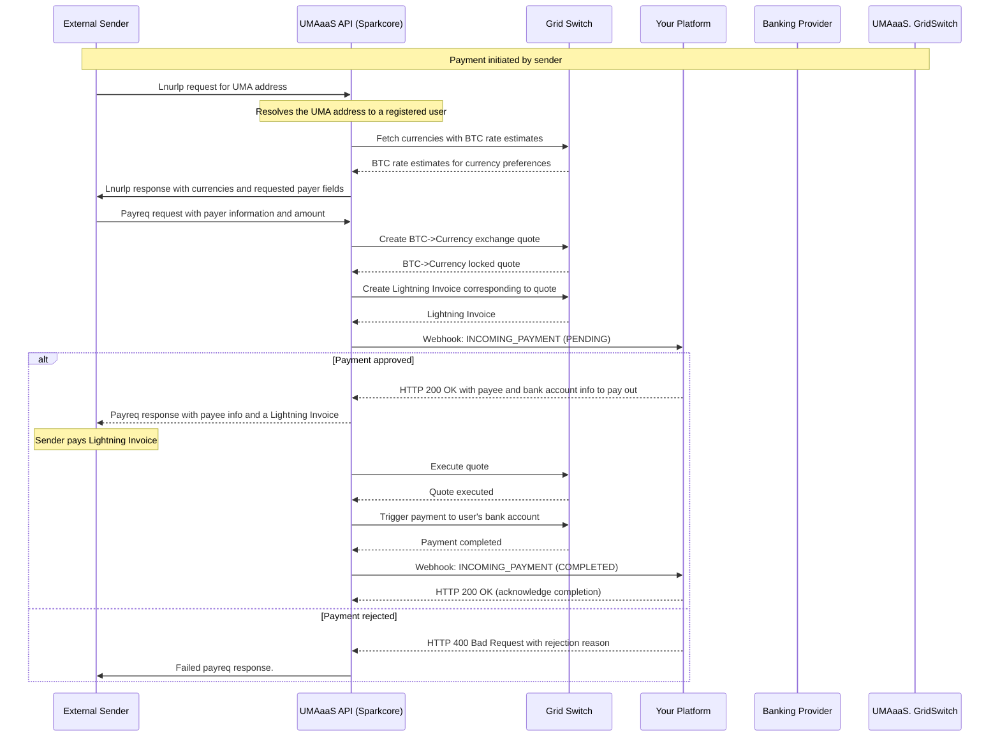
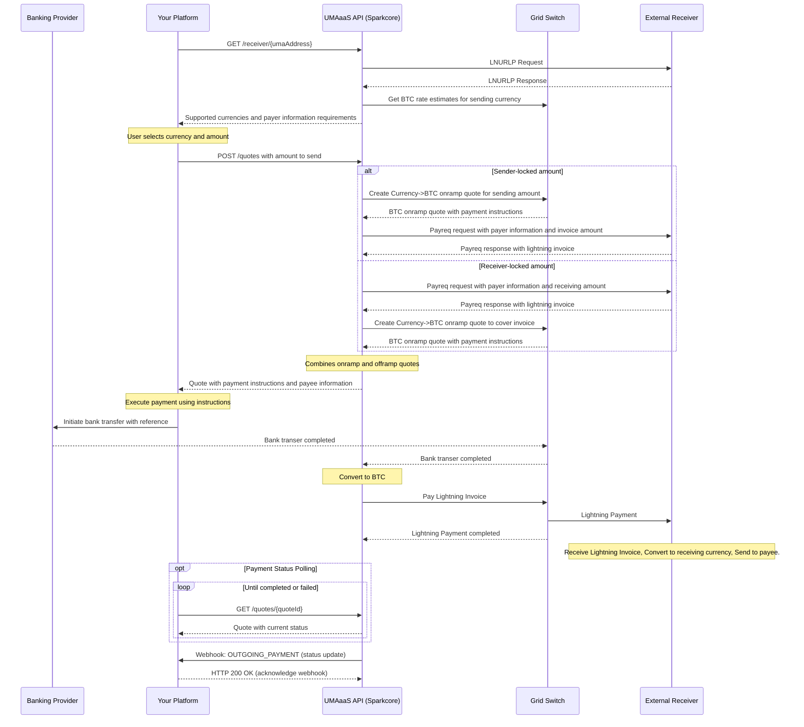

# Detailed Payment Flows

This page contains a very detailed diagram of the payment process including UMA messaging and internal UMAaaS flows betwen the grid switch and sparkcore.

## Receiving Payments

## Sending Payments

