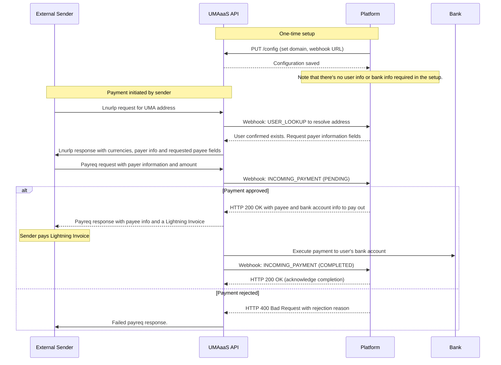

# Receiving Payments - alternative JIT flow  

This guide outlines the process for platforms to receive payments from UMA addresses, but with an alternative just in time (JIT) user information flow.

## Process Overview

The following sequence diagram illustrates the interaction between your platform and the UMAaaS API when receiving payments:



The process consists of five main steps:

1. **Platform configuration** (one-time setup) to set your UMA domain and required counterparty fields
2. **Register users** with their bank account information so they can receive payments
3. **Set up webhook endpoints** to receive notifications about incoming payments
4. **Receive and approve/reject incoming payments** via webhooks
5. **Receive completion notification** when the payment completes

## Step 1: Platform configuration (one-time setup)

Configure your platform settings (if you haven't already in the onboarding process), including the required counterparty information.

```http
PUT /config
```

Request body:

```json
{
  "umaDomain": "mycompany.com",
  "webhookEndpoint": "https://api.mycompany.com/webhooks/uma",
  "requiredCounterpartyFields": [
    {
      "name": "FULL_NAME",
      "mandatory": true
    },
    {
      "name": "DATE_OF_BIRTH",
      "mandatory": true
    }
  ]
}
```

## [Optional] Step 2: Register users *without* bank account information

In order to get rid of the USER_LOOKUP webook on lnurlp requests, you can register your users in the system so that UMAaaS can resolve the address as a valid user without the USER_LOOKUP webhook. Note that bank account information could still be given during the payreq flow, so it's not needed here. Same with the payee information that was given in the pre-registration flow.

```http
POST /users
```

Request body:

```json
{
  "umaAddress": "$john.sender@uma.domain.com",
  "platformUserId": "9f84e0c2a72c4fa",
}
```

## Step 3: Webhook setup (one-time setup)

Configure your webhook endpoints to receive notifications about incoming payments. You'll need to implement the webhook endpoints on your server. Remember to validate webhook signatures to ensure they are authentic.

## Step 4: Receive and approve incoming payments

When someone initiates a payment to one of your users' UMA addresses, you'll receive a webhook call with a pending transaction:

```json
{
  "transaction": {
    "transactionId": "Transaction:019542f5-b3e7-1d02-0000-000000000005",
    "status": "PENDING",
    "type": "INCOMING",
    "senderUmaAddress": "$sender@external.domain",
    "receiverUmaAddress": "$recipient@uma.domain",
    "receivedAmount": {
      "amount": 50000,
      "currency": {
        "code": "USD",
        "name": "United States Dollar",
        "symbol": "$",
        "decimals": 2
      }
    },
    "userId": "User:019542f5-b3e7-1d02-0000-000000000001",
    "platformUserId": "9f84e0c2a72c4fa",
    "counterpartyInformation": {
      "fullName": "John Sender",
      "dateOfBirth": "1985-06-15"
    },
    "requiredPayeeInformationFields": [
      {
        "name": "FULL_NAME",
        "mandatory": true
      },
      {
        "name": "DATE_OF_BIRTH",
        "mandatory": true
      }
    ]
  },
  "timestamp": "2023-08-15T14:32:00Z",
  "webhookId": "Webhook:019542f5-b3e7-1d02-0000-000000000007",
  "type": "INCOMING_PAYMENT"
}
```

To approve the payment, respond with a 200 OK status and include the payee information and bank account information to pay out.

```json
{
  "payeeInformation": {
    "fullName": "John Sender",
    "dateOfBirth": "1985-06-15"
  },
  "bankAccountInfo": {
    "accountType": "CLABE",
    "accountNumber": "123456789012345678",
    "bankName": "Banco de México"
  }
}

To reject the payment, respond with a 400 Bad Request status and a JSON body with the following fields:

```json
{
  "code": "payment_rejected",
  "message": "Payment rejected due to compliance policy",
  "details": {
    "reason": "failed_counterparty_check",
    "rejectionReason": "User is in a restricted jurisdiction"
  }
}
```

Note that UMAaas will need to store this bank account information to pay out the payment when the lightning invoice is paid. The bank account information is not shared with the sender, but the payee information is.

## Step 5: Receive completion notification

When the payment completes, your webhook endpoint will receive another notification:

```json
{
  "transaction": {
    "transactionId": "Transaction:019542f5-b3e7-1d02-0000-000000000005",
    "status": "COMPLETED",
    "type": "INCOMING",
    "senderUmaAddress": "$sender@external.domain",
    "receiverUmaAddress": "$recipient@uma.domain",
    "receivedAmount": {
      "amount": 50000,
      "currency": {
        "code": "USD",
        "name": "United States Dollar",
        "symbol": "$",
        "decimals": 2
      }
    },
    "userId": "User:019542f5-b3e7-1d02-0000-000000000001",
    "platformUserId": "9f84e0c2a72c4fa",
    "settlementTime": "2023-08-15T14:30:00Z",
    "createdAt": "2023-08-15T14:25:18Z",
    "description": "Payment for services",
    "quoteId": "Quote:019542f5-b3e7-1d02-0000-000000000006"
  },
  "timestamp": "2023-08-15T14:32:00Z",
  "webhookId": "Webhook:019542f5-b3e7-1d02-0000-000000000007",
  "type": "INCOMING_PAYMENT"
}
```
