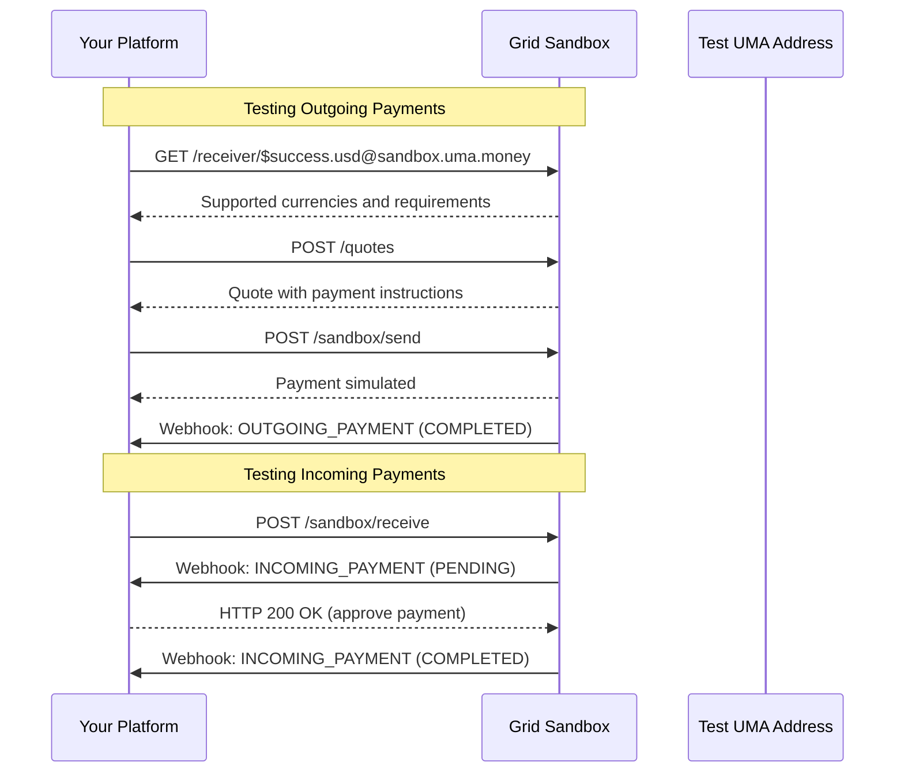

The Grid sandbox environment allows you to test your integration without making real payments. When you set up your account, you can configure production and sandbox API tokens. The sandbox token is specifically for testing and development purposes.
It corresponds to a separate platform instance in "sandbox" mode, which can only transact with the sandbox UMA addresses for testing.

## Overview

The sandbox environment provides:

1. A dedicated sandbox platform for testing
2. Test UMA addresses for simulating payments
3. Endpoints to simulate sending and receiving payments
4. All the same webhooks and flows as production, but with simulated funds

## Test UMA Addresses

The sandbox provides several test UMA addresses you can use to simulate different scenarios:

| UMA Address | Description |
|------------|-------------|
| `$success.usd@sandbox.uma.money` | Always succeeds, sends USD |
| `$success.eur@sandbox.uma.money` | Always succeeds, sends EUR |
| `$success.mxn@sandbox.uma.money` | Always succeeds, sends MXN |
| `$pending.long.usd@sandbox.uma.money` | Simulates a long-pending payment |
| `$fail.compliance.usd@sandbox.uma.money` | Simulates compliance check failure |

## Testing Outgoing Payments

To test sending payments from your platform, follow these steps:



1. Look up a sandbox UMA address:

```bash
curl -X GET "https://api.lightspark.com/grid/2025-10-13/receiver/\$success.usd@sandbox.uma.money" \
  -H "Authorization: Basic <base64-encoded-credentials>"
```

2. Create a quote as normal:

```bash
curl -X POST "https://api.lightspark.com/grid/2025-10-13/quotes" \
  -H "Authorization: Basic <base64-encoded-credentials>" \
  -H "Content-Type: application/json" \
  -d '{
    "lookupId": "Lookup:019542f5-b3e7-1d02-0000-000000000009",
    "sendingCurrencyCode": "MXN",
    "receivingCurrencyCode": "USD",
    "lockedCurrencySide": "SENDING",
    "lockedCurrencyAmount": 10000
  }'
```

3. Instead of making a real bank transfer, use the sandbox send endpoint:

```bash
curl -X POST "https://api.lightspark.com/grid/2025-10-13/sandbox/send" \
  -H "Authorization: Basic <base64-encoded-credentials>" \
  -H "Content-Type: application/json" \
  -d '{
    "reference": "UMA-Q12345-REF",
    "currencyCode": "USD",
    "currencyAmount": 10000
  }'
```

The sandbox will simulate the payment and send appropriate webhooks just like in production.

## Testing Incoming Payments

To test receiving payments to your platform's users, use the sandbox receive endpoint:

```bash
curl -X POST "https://api.lightspark.com/grid/2025-10-13/sandbox/receive" \
  -H "Authorization: Basic <base64-encoded-credentials>" \
  -H "Content-Type: application/json" \
  -d '{
    "senderUmaAddress": "$success.usd@sandbox.uma.money",
    "receiverUmaAddress": "$your.user@your.domain",
    "receivingCurrencyCode": "USD",
    "receivingCurrencyAmount": 5000
  }'
```

This will trigger the same webhook flow as a real incoming payment:

1. You'll receive an `INCOMING_PAYMENT` webhook with `status: "PENDING"`
2. Your platform should approve/reject the payment
3. On approval, you'll receive another webhook with `status: "COMPLETED"`

## Example Testing Flow

Here's a complete example of testing both directions of payments:

1. First, register a test user:

```bash
curl -X POST "https://api.lightspark.com/grid/2025-10-13/users" \
  -H "Authorization: Basic <base64-encoded-credentials>" \
  -H "Content-Type: application/json" \
  -d '{
    "umaAddress": "$test.user@your.domain",
    "platformUserId": "test_123",
    "userType": "INDIVIDUAL",
    "fullName": "Test User",
    "birthDate": "1990-01-01",
    "address": {
      "line1": "123 Test St",
      "city": "Testville",
      "state": "TS",
      "postalCode": "12345",
      "country": "US"
    },
    "bankAccountInfo": {
      "accountType": "US_ACCOUNT",
      "accountNumber": "123456789",
      "routingNumber": "987654321",
      "accountCategory": "CHECKING",
      "bankName": "Test Bank"
    }
  }'
```

2. Test receiving a payment:

```bash
curl -X POST "https://api.lightspark.com/grid/2025-10-13/sandbox/receive" \
  -H "Authorization: Basic <base64-encoded-credentials>" \
  -H "Content-Type: application/json" \
  -d '{
    "senderUmaAddress": "$success.usd@sandbox.uma.money",
    "receiverUmaAddress": "$test.user@your.domain",
    "receivingCurrencyCode": "USD",
    "receivingCurrencyAmount": 5000
  }'
```

3. Test sending a payment:

```bash
# 1. Look up recipient
curl -X GET "https://api.lightspark.com/grid/2025-10-13/receiver/\$success.usd@sandbox.uma.money" \
  -H "Authorization: Basic <base64-encoded-credentials>"

# 2. Create quote
curl -X POST "https://api.lightspark.com/grid/2025-10-13/quotes" \
  -H "Authorization: Basic <base64-encoded-credentials>" \
  -H "Content-Type: application/json" \
  -d '{
    "lookupId": "Lookup:019542f5-b3e7-1d02-0000-000000000009",
    "sendingCurrencyCode": "MXN",
    "receivingCurrencyCode": "USD",
    "lockedCurrencySide": "SENDING",
    "lockedCurrencyAmount": 10000
  }'

# 3. Simulate sending payment
curl -X POST "https://api.lightspark.com/grid/2025-10-13/sandbox/send" \
  -H "Authorization: Basic <base64-encoded-credentials>" \
  -H "Content-Type: application/json" \
  -d '{
    "reference": "UMA-Q12345-REF",
    "currencyCode": "USD",
    "currencyAmount": 10000
  }'
```

## Testing Error Scenarios

You can test various error scenarios using the special sandbox UMA addresses:

1. Test compliance failures:

```bash
curl -X GET "https://api.lightspark.com/grid/2025-10-13/receiver/\$fail.compliance.usd@sandbox.uma.money" \
  -H "Authorization: Basic <base64-encoded-credentials>"
# ... create quote and attempt payment
```

2. Test long-pending payments:

```bash
curl -X GET "https://api.lightspark.com/grid/2025-10-13/receiver/\$pending.long.usd@sandbox.uma.money" \
  -H "Authorization: Basic <base64-encoded-credentials>"
# ... create quote and attempt payment
```

3. Non-existent UMA address:

```bash
curl -X GET "https://api.lightspark.com/grid/2025-10-13/receiver/\$non.existent.usd@sandbox.uma.money" \
  -H "Authorization: Basic <base64-encoded-credentials>"
# ... should return 404 Not Found
```

Each of these will trigger appropriate error webhooks and status updates to help you test your error handling.

## Production vs Sandbox

Here are the key differences between production and sandbox environments:

1. **API Tokens**: Sandbox tokens only work in the sandbox environment and vice versa
2. **Bank Transfers**: In sandbox, you use `/sandbox/send` instead of real bank transfers
3. **Test UMA Addresses**: Special sandbox addresses for testing different scenarios
4. **Money**: No real money is moved in sandbox

Always test thoroughly in sandbox before moving to production!
