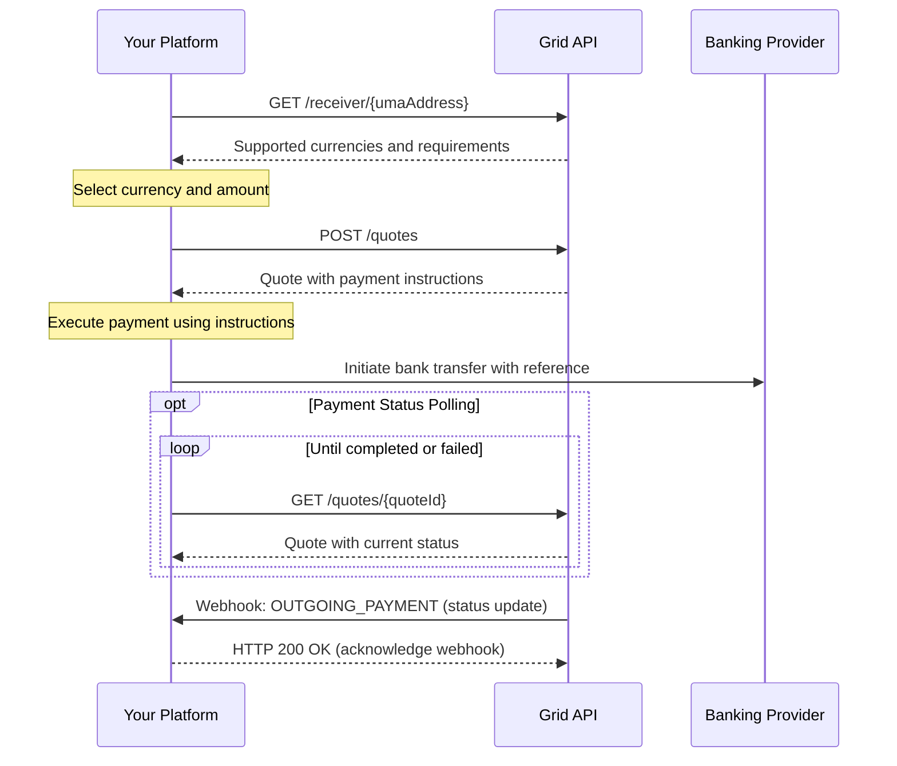
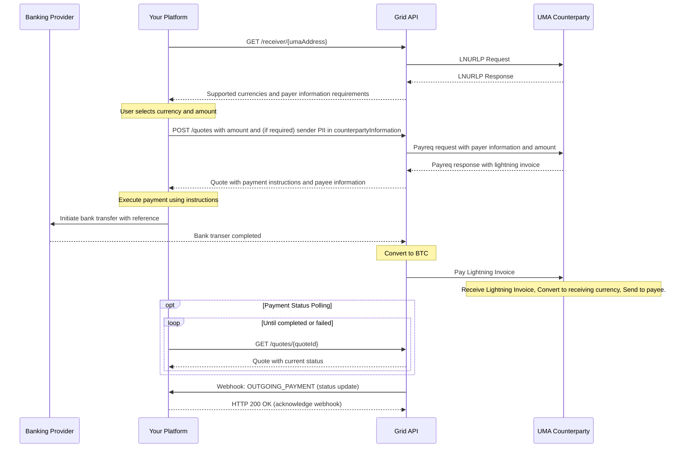

This guide outlines the process for platforms to send payments to UMA addresses.

## Process Overview

The following sequence diagram illustrates the interaction between your platform and the Grid API when sending payments:



The process consists of five main steps:

1. **Look up the recipient's UMA address** to validate it and retrieve supported currencies
2. **Create a payment quote** to lock in exchange rates and get payment instructions
3. **Execute the payment** through your banking provider using the instructions
4. **Track the payment status** by polling or waiting for a webhook
5. **Receive completion notification** when the payment completes or fails

## Step 1: Look up recipient UMA address

First, check if a UMA address is valid and retrieve supported currencies and exchange rates.

```bash
curl -X GET "https://api.lightspark.com/grid/2025-10-13/receiver/\$recipient@example.com?platformUserId=9f84e0c2a72c4fa" \
  -H "Authorization: Basic <base64-encoded-credentials>"
```

Response:

```json
{
  "receivingUmaAddress": "$recipient@example.com",
  "supportedCurrencies": [
    {
      "currency": {
        "code": "USD",
        "name": "United States Dollar",
        "symbol": "$",
        "decimals": 2
      },
      "estimatedExchangeRate": 1.0,
      "min": 100,
      "max": 10000000
    },
    {
      "currency": {
        "code": "EUR",
        "name": "Euro",
        "symbol": "€",
        "decimals": 2
      },
      "estimatedExchangeRate": 0.92,
      "min": 100,
      "max": 9000000
    }
  ],
  "requiredPayerDataFields": [
    {
      "name": "FULL_NAME",
      "mandatory": true
    },
    {
      "name": "BIRTH_DATE",
      "mandatory": true
    }
  ]
}
```

This response tells you the currencies the recipient can receive and, crucially, any information the recipient's VASP requires about *your user (the sender)* in the `requiredPayerDataFields` array before a payment can be processed.

## Step 2: Create a payment quote

Generate a quote for the payment with locked exchange rates and fees.

```bash
curl -X POST "https://api.lightspark.com/grid/2025-10-13/quotes" \
  -H "Authorization: Basic <base64-encoded-credentials>" \
  -H "Content-Type: application/json" \
  -d '{
    "lookupId": "Lookup:019542f5-b3e7-1d02-0000-000000000009",
    "sendingCurrencyCode": "USD",
    "receivingCurrencyCode": "EUR",
    "lockedCurrencySide": "SENDING",
    "lockedCurrencyAmount": 10000,
    "description": "Invoice #1234 payment",
    "senderUserInfo": {
      "FULL_NAME": "John Sender",
      "BIRTH_DATE": "1985-06-15"
    }
  }'
```

If the `requiredPayerDataFields` array from the previous step (looking up the receiver) was not empty, you **must** include the `senderUserInfo` object in your quote request. This object should contain key-value pairs for each field that was listed as mandatory in `requiredPayerDataFields`. This is PII about your user (the sender) that the recipient's VASP requires.

Response:

```json
{
  "quoteId": "Quote:019542f5-b3e7-1d02-0000-000000000006",
  "sendingCurrency": {
    "code": "USD",
    "name": "United States Dollar",
    "symbol": "$",
    "decimals": 2
  },
  "receivingCurrency": {
    "code": "EUR",
    "name": "Euro",
    "symbol": "€",
    "decimals": 2
  },
  "totalSendingAmount": 10100,
  "totalReceivingAmount": 9200,
  "exchangeRate": 0.92,
  "expiresAt": "2023-09-01T14:30:00Z",
  "feesIncluded": 100,
  "counterpartyInformation": {
    "FULL_NAME": "Jane Doe",
    "BIRTH_DATE": "1992-03-25"
  },
  "paymentInstructions": {
    "reference": "UMA-Q12345-REF",
    "bankAccountInfo": {
      "accountType": "US_ACCOUNT",
      "accountNumber": "987654321",
      "routingNumber": "123456789",
      "accountCategory": "CHECKING",
      "bankName": "Chase Bank"
    }
  }
}
```

## Step 3: Execute the payment

Use the `paymentInstructions` from the quote to execute a payment through your banking provider. Be sure to include the provided reference code if applicable.

## Step 4: Track payment status

You can track the status of your payment by polling the payment status endpoint or waiting for the webhook notification. To poll the payment status, use the following endpoint:

```bash
curl -X GET "https://api.lightspark.com/grid/2025-10-13/quotes/Quote:019542f5-b3e7-1d02-0000-000000000006" \
  -H "Authorization: Basic <base64-encoded-credentials>"
```

Response:

```json
{
  "quoteId": "Quote:019542f5-b3e7-1d02-0000-000000000006",
  "sendingCurrency": {
    "code": "USD",
    "name": "United States Dollar",
    "symbol": "$",
    "decimals": 2
  },
  "receivingCurrency": {
    "code": "EUR",
    "name": "Euro",
    "symbol": "€",
    "decimals": 2
  },
  "totalSendingAmount": 10100,
  "totalReceivingAmount": 9200,
  "exchangeRate": 0.92,
  "expiresAt": "2023-09-01T14:30:00Z",
  "feesIncluded": 100,
  "counterpartyInformation": {
    "FULL_NAME": "Jane Doe",
    "BIRTH_DATE": "1992-03-25"
  },
  "paymentInstructions": {
    "reference": "UMA-Q12345-REF",
    "bankAccountInfo": {
      "accountType": "US_ACCOUNT",
      "accountNumber": "987654321",
      "routingNumber": "123456789",
      "accountCategory": "CHECKING",
      "bankName": "Chase Bank"
    }
  },
  "status": "COMPLETED",
  "transactionId": "Transaction:019542f5-b3e7-1d02-0000-000000000005"
}
```

## Step 5: Receive webhook notification

When the payment status changes (to completed or failed), your platform will receive a webhook notification at your configured webhook endpoint:

```json
{
  "transaction": {
    "transactionId": "Transaction:019542f5-b3e7-1d02-0000-000000000005",
    "status": "COMPLETED",
    "type": "OUTGOING",
    "senderUmaAddress": "$sender@uma.domain",
    "receiverUmaAddress": "$recipient@external.domain",
    "sentAmount": {
      "amount": 10550,
      "currency": {
        "code": "USD",
        "name": "United States Dollar",
        "symbol": "$",
        "decimals": 2
      }
    },
    "receivedAmount": {
      "amount": 9706,
      "currency": {
        "code": "EUR",
        "name": "Euro",
        "symbol": "€",
        "decimals": 2
      }
    },
    "userId": "User:019542f5-b3e7-1d02-0000-000000000001",
    "platformUserId": "9f84e0c2a72c4fa",
    "settlementTime": "2023-08-15T14:30:00Z",
    "createdAt": "2023-08-15T14:25:18Z",
    "description": "Payment for invoice #1234",
    "exchangeRate": 0.92,
    "quoteId": "Quote:019542f5-b3e7-1d02-0000-000000000006",
    "paymentInstructions": {
      "reference": "UMA-Q12345-REF",
      "bankAccountInfo": {
        "accountType": "US_ACCOUNT",
        "accountNumber": "987654321",
        "routingNumber": "123456789",
        "accountCategory": "CHECKING",
        "bankName": "Chase Bank"
      }
    }
  },
  },
  "timestamp": "2023-08-15T14:32:00Z",
  "webhookId": "Webhook:019542f5-b3e7-1d02-0000-000000000007",
  "type": "OUTGOING_PAYMENT"
}
```

## Detailed UMA flow

This section is not necessary knowledge for platforms, but it describes the flow at a more detailed level including UMA protocol messages for those who are curious.


